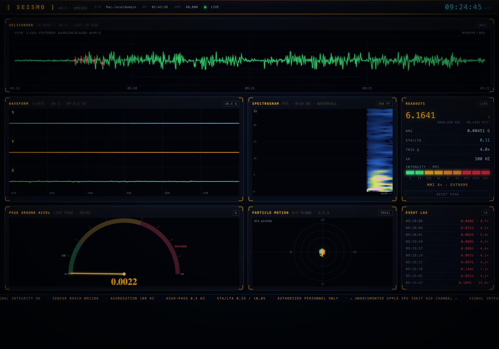
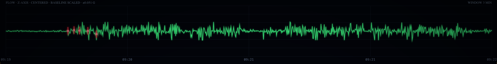
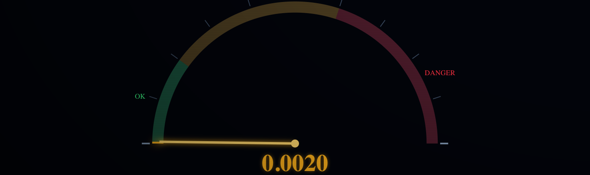

# seismo

> I made this because I don't want to lose the joy of making things.

`seismo` turns the hidden motion sensor inside certain Apple Silicon MacBooks
into a live desktop seismograph. It reads the undocumented `AppleSPU` IMU,
filters the signal, detects impacts, and renders the whole thing as a local
dashboard that feels more like an instrument than a demo.

It is part hardware hack, part signal-processing toy, part reminder that the
most fun projects are often the ones nobody asked for.



## Why this exists

I wanted a project that felt playful again.

Modern laptops are full of strange hardware you never get to touch. Apple
ships a real motion sensor in some MacBooks, and it mostly sits there hidden
behind private system interfaces. `seismo` exists because it is deeply
satisfying to pull that sensor into the open, watch your desk become data, and
turn invisible vibration into something alive on screen.

This is not a scientific instrument. It is a serious toy built for the joy of
making something weird, tactile, and real.

## What it does

- Reads live acceleration from the MacBook's internal IMU
- High-pass filters the raw signal so small motion is easier to see
- Tracks peak ground acceleration, RMS, and STA/LTA-style event triggers
- Shows a real-time dashboard in the browser
- Includes a small macOS menu bar app wrapper
- Supports a mock mode for UI work without real hardware

## Screens

| Dashboard | Helicorder / flow view | Peak meter |
| --- | --- | --- |
|  |  |  |

> Screenshots were captured from the live local dashboard with Puppeteer.

## How it works

At a high level:

1. The backend opens the undocumented Apple motion sensor path through
   `IOKit`/HID on macOS.
2. Acceleration samples are streamed into a lightweight shared-memory ring
   buffer.
3. `seismo` reads those samples, filters them, and computes:
   - high-pass X/Y/Z waveforms
   - instantaneous magnitude
   - peak ground acceleration
   - RMS
   - STA/LTA trigger ratio
4. A local HTTP server publishes the dashboard at
   `http://127.0.0.1:8766`.
5. The frontend renders everything with Canvas in real time.

The result is less “earthquake lab equipment” and more “watch your laptop
become a vibration instrument.”

## Tech stack

- **Go**
  - sensor worker orchestration
  - signal processing
  - local HTTP server
- **IOKit / Apple SPU HID**
  - direct access to the MacBook IMU
- **POSIX shared memory**
  - low-overhead transport between sensor code and consumer loop
- **HTML + JavaScript + Canvas**
  - real-time dashboard rendering
- **Swift + `SMAppService`**
  - menu bar app wrapper and helper registration on macOS

## What it can detect

In a quiet room on a desk, this thing can pick up more than you might expect:

- typing through the chassis
- taps on the desk
- footsteps on nearby flooring
- doors closing
- trucks or heavy external vibration
- real local shaking events
- absurdly tiny motion when the setup is quiet enough

Again: this is **not** a calibrated scientific seismometer.

It is a consumer IMU being used in a delightfully inappropriate way.

## Supported hardware

`seismo` only works on Apple Silicon Macs that actually expose the internal SPU
motion hardware used here.

From the current project notes:

- supported: **M2+ MacBooks**, and the **M1 Pro MacBook SKU**
- not supported: **Intel Macs**, **plain M1**, **Mac Studio**

If the machine does not have the sensor, there is nothing to read.

## Quick start

### Real hardware

Build:

```bash
go build -o seismo ./cmd/seismo
```

Run:

```bash
sudo ./seismo
```

Open:

```text
http://127.0.0.1:8766
```

### Mock mode

Mock mode is great when you want to iterate on the dashboard without needing
the real sensor path:

```bash
./seismo --mock
```

This drives the full UI with synthetic microseismic noise plus periodic
impulse-like events.

## Flags

```text
-addr     HTTP bind address               (default 127.0.0.1:8766)
-window   waveform window in seconds      (default 600)
-sta      STA window in seconds           (default 0.5)
-lta      LTA window in seconds           (default 10.0)
-trigger  STA/LTA ratio to flag an event  (default 4.0)
-record   CSV file to append samples to   (optional)
-mock     synthetic sensor demo mode      (default false)
```

## Recording raw data

```bash
sudo ./seismo -record ~/seismo.csv
```

Output columns:

```text
t,x,y,z,hx,hy,hz,mag
```

- `x,y,z`: raw acceleration in `g`
- `hx,hy,hz`: high-pass filtered acceleration
- `mag`: combined magnitude

## Menu bar app

This repo also ships a small macOS wrapper app:

```bash
./app/build.sh
open app/Seismo.app
```

The app wraps the Go helper in a menu bar experience and uses
`SMAppService` to manage helper registration.

Typical flow:

1. Build `Seismo.app`
2. Copy it to `/Applications`
3. Launch it
4. Use **enable helper…** or **repair helper registration…**
5. Approve it in **System Settings → General → Login Items & Extensions** if macOS asks

## Why `sudo` is needed

The motion sensor path used here is gated behind low-level macOS system APIs.
Apple does not expose this sensor through the normal public motion frameworks
on macOS, so opening it requires root privileges.

## Caveats

- This depends on undocumented Apple hardware paths.
- Hardware availability varies by Mac model.
- The visualizations are intentionally tuned for responsiveness and feel, not
  formal scientific calibration.
- If the helper is stale, restart or re-register it so the latest embedded
  dashboard is what `localhost` actually serves.

## Credits

- Sensor path originally ported from
  [olvvier/apple-silicon-accelerometer](https://github.com/olvvier/apple-silicon-accelerometer)
  via
  [taigrr/apple-silicon-accelerometer](https://github.com/taigrr/apple-silicon-accelerometer)
- STA/LTA trigger idea from classic earthquake detection workflows

## License

MIT
